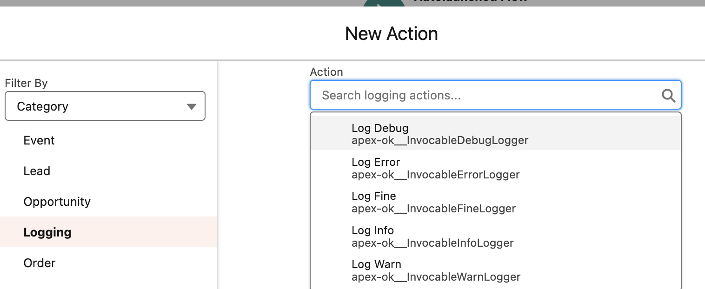

# Flow Logging

Logging from a flow supports following log levels:

-   ERROR - Using
    [InvocableErrorLogger](../../reference/InvocableErrorLogger.md).
-   WARN - Using [InvocableWarnLogger](../../reference/InvocableWarnLogger.md).
-   INFO - Using [InvocableInfoLogger](../../reference/InvocableInfoLogger.md).
-   DEBUG - Using
    [InvocableDebugLogger](../../reference/InvocableDebugLogger.md).
-   FINE - Using [InvocableFineLogger](../../reference/InvocableFineLogger.md).

All loggers are tagged with the `Logging` category.

To publish a log, add a new action element and search for corresponding logger.
Each invocation publishes logs immediately.

> Flow logs and Apex logs in the same transaction are grouped in a Transaction
> Log record.

